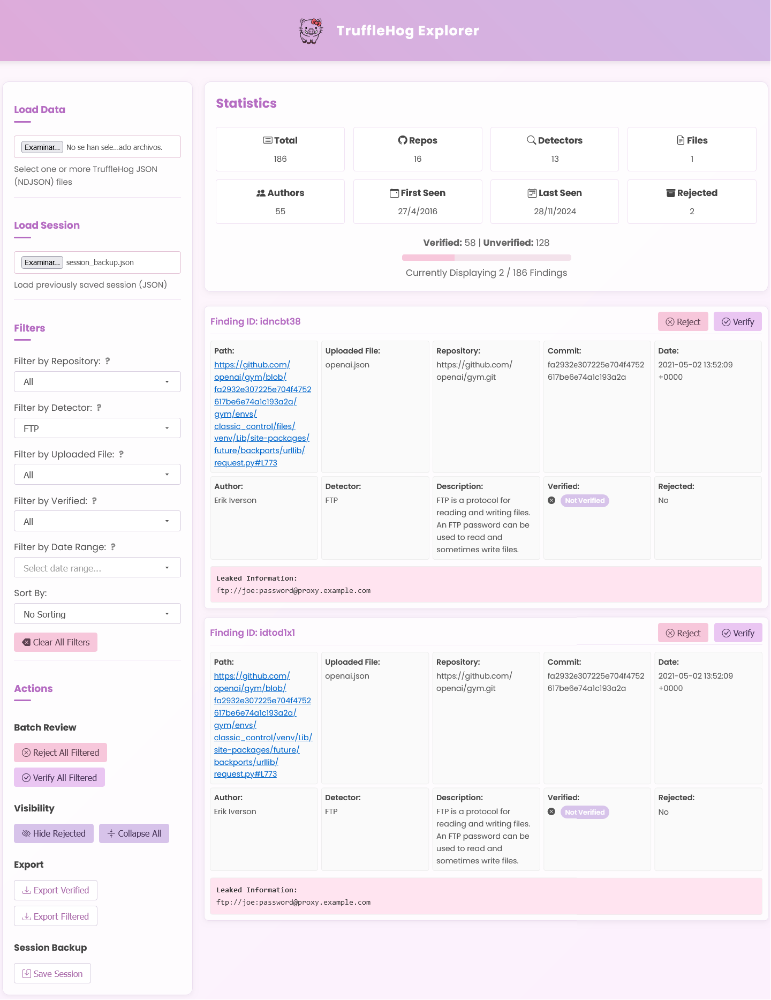

# TruffleHog Explorer 🕵️‍♂️

Welcome to **TruffleHog Explorer**, a user-friendly web-based tool to visualize and analyze data extracted using [TruffleHog](https://github.com/trufflesecurity/trufflehog). TruffleHog is one of the most powerful secrets discovery, classification, validation, and analysis open source tool. In this context, a secret refers to a credential a machine uses to authenticate itself to another machine. This includes API keys, database passwords, private encryption keys, and more.

With an improved UI/UX, powerful filtering options, and export capabilities, this tool helps security professionals efficiently review potential secrets and credentials found in their repositories.

> ⚠️ This dashboard has been tested only with GitHub TruffleHog JSON outputs. Expect updates soon to support additional formats and platforms.




---

## 🚀 Features

- **Intuitive UI/UX:** Beautiful pastel theme with smooth navigation.
- **Powerful Filtering:**
  - Filter findings by repository, detector type, and uploaded file.
  - Flexible date range selection with a calendar picker.
  - Verification status categorization for effective review.
  - Advanced search capabilities for faster identification.
- **Batch Operations:**
  - Verify or reject multiple findings with a single click.
  - Toggle visibility of rejected results for a streamlined view.
  - Bulk processing to manage large datasets efficiently.
- **Export Capabilities:**
  - Export verified secrets or filtered findings effortlessly.
  - Save and load session backups for continuity.
  - Generate reports in multiple formats (JSON, CSV).
- **Dynamic Sorting:**
  - Sort results by repository, date, or verification status.
  - Customizable sorting preferences for a personalized experience.

---

## 📥 Installation & Usage

### 1. Clone the Repository
```bash
$ git clone https://github.com/yourusername/trufflehog-explorer.git
$ cd trufflehog-explorer
```

### 2. Open the `index.html`
Simply open the `index.html` file in your preferred web browser.

```bash
$ open index.html
```

---

## 📂 How to Use

1. **Upload TruffleHog JSON Findings:**
   - Click on the **"Load Data"** section and select your `.json` files from [TruffleHog](https://github.com/trufflesecurity/trufflehog) output.
   - Multiple files are supported.
2. **Apply Filters:**
   - Choose filters such as repository, detector type, and verification status.
   - Utilize the date range picker to narrow down findings.
   - Leverage the search function to locate specific findings quickly.
3. **Review Findings:**
   - Click on a finding to expand and view its details.
   - Use the action buttons to verify or reject findings.
   - Add comments and annotations for better tracking.
4. **Export Results:**
   - Export verified or filtered findings for reporting.
   - Save session data for future review and analysis.
5. **Save Your Progress:**
   - Save your session and resume later without losing any progress.
   - Automatic backup feature to prevent data loss.

---

## 📊 Screenshots


---

**Happy Securing! 🔒**

